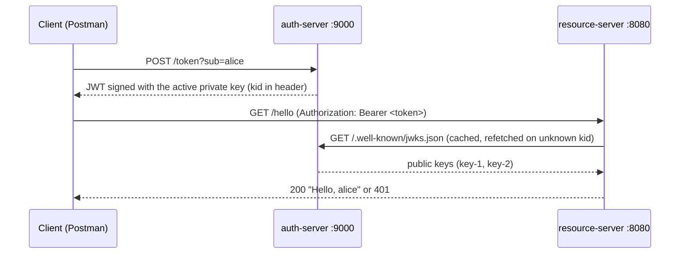

# Mini OAuth 2.0 Platform

Two Spring Boot services that show how a JWT is issued, published for verification, and validated:

- **auth-server** (port 9000): issues RS256-signed JWTs and publishes its public keys as a JWKS.
- **resource-server** (port 8080): exposes a secured `GET /hello` and validates tokens against that JWKS.

Built with Java 21, Spring Boot 4.1.1, Maven, and Nimbus JOSE + JWT.

## Architecture



The resource server never sees a private key. It reads the `kid` from the token header, finds the matching public key in the JWKS, verifies the signature, then checks `iss`, `aud` and `exp`.

## Endpoints

| Service | Endpoint | Description |
|---|---|---|
| auth-server | `POST /token?sub={subject}` | Returns `access_token`, `token_type`, `expires_in` |
| auth-server | `GET /.well-known/jwks.json` | Public keys, one per `kid` |
| resource-server | `GET /hello` | Requires a valid bearer token. Returns `Hello, {sub}` |
| resource-server | `GET /actuator/health` | Open |

## Prerequisites

- Java 21
- Ports 9000 and 8080 free

## Build and test

Run in each module (`auth-server`, `resource-server`):

```bash
./mvnw clean verify
```

On Windows use `mvnw.cmd`.

## Run

Start the auth server first, then the resource server, each in its own terminal:

```bash
cd auth-server
./mvnw spring-boot:run
```

```bash
cd resource-server
./mvnw spring-boot:run
```

## Run with Docker

Requires Docker only. From the repo root:

```bash
docker compose up --build
```

The auth server starts on port 9000 and the resource server on port 8080. Inside Docker, the resource server fetches the JWKS from `http://auth-server:9000`, set in `docker-compose.yml`.

Stop with `Ctrl+C`, then `docker compose down`.

## Try it

```bash
# 1. Get a token
curl -X POST "http://localhost:9000/token?sub=alice"

# 2. Call the API without a token: 401
curl -i http://localhost:8080/hello

# 3. Call it with the token: 200 "Hello, alice"
curl -i -H "Authorization: Bearer <access_token>" http://localhost:8080/hello

# 4. Inspect the published keys
curl http://localhost:9000/.well-known/jwks.json
```

In PowerShell, use `curl.exe` instead of `curl`. Tokens expire after 5 minutes.

## How the resource server gets the public key

The auth server signs tokens with a private RSA key. The resource server needs the matching public key to verify them. I considered three options.

**1. One public key in the resource server's configuration.**
Simple to set up, but it does not support key rotation. A new key requires a config change and a redeploy of the resource server, and tokens signed with the old key stop working.

**2. Multiple public keys in the resource server's configuration.**
The resource server selects a key by the `kid` in the token, so old and new keys can work at the same time. But every new key still requires a change to the resource server.

**3. JWKS endpoint (chosen).**
The auth server exposes `GET /.well-known/jwks.json`, and the resource server fetches the keys from it.

I chose option 3 for these reasons:

- Keys are managed in one place, the auth server. The resource server only needs a URL.
- Rotation requires no change to the resource server. It looks up the `kid` in the JWKS and refetches if the `kid` is unknown.
- Spring Security supports it directly through `jwk-set-uri`, so no key-loading code is needed.

The trade-off is that the resource server needs the auth server to be reachable the first time it fetches the keys. After that, the keys are cached.

## Key rotation

The auth server holds two RSA key pairs, `key-1` and `key-2`, and publishes both public keys in the JWKS. The signing key is chosen by configuration:

```yaml
auth:
  signing:
    active-key-id: key-1
```

To rotate, change `active-key-id` to `key-2` and restart the auth server. New tokens carry `kid: key-2`, and the resource server accepts them with no change on its side, because key-2 is already in the JWKS.

The automated proof is `HelloSecurityTest.hello_tokenSignedWithKey2_returns200`.

## Design decisions

- **Hand-rolled issuer with Nimbus instead of Spring Authorization Server.** The assignment needs one endpoint that signs a token. A small `TokenService` is easier to read, test and explain line by line than a full authorization-server framework.
- **RS256, not HS256.** With a shared secret, anyone who can verify a token can also forge one. With an RSA key pair, the resource server only holds public keys.
- **JWKS endpoint for key distribution.** See "How the resource server gets the public key".
- **`KeyProvider` abstraction.** Key storage and the choice of active key live in one class. Rotation is a config change, not a code change.
- **Typed configuration.** `SigningProperties` is a validated `@ConfigurationProperties` record, so a bad config fails at startup. An unknown `active-key-id` also fails at startup.
- **No custom security filter in the resource server.** Spring Security's OAuth2 resource server support does extraction, signature verification and claim validation. `SecurityConfig` only declares the rules: stateless, CSRF off (no cookies), `/hello` authenticated.
- **Issuer and audience are validated,** not only the signature, so a token minted for another API or by another issuer is rejected.
- **RFC 9457 `ProblemDetail` error bodies** on both services. The 401 body is deliberately generic and does not say why a token failed.

## Tests

| Class | Type | Covers |
|---|---|---|
| `TokenServiceTest` | Unit | Claims, TTL, header `kid` and algorithm, signature verifies with the active key and fails with the other |
| `KeyProviderTest` | Unit | Active key selection, published set has both keys and no private material, bad config fails |
| `TokenControllerTest` | `@WebMvcTest` | 200 response shape, blank and missing `sub` return 400, signing failure returns 500 |
| `JwksControllerTest` | `@WebMvcTest` | Two keys, RFC 7517 field names, no private field `d` |
| `HelloSecurityTest` | Integration | No token, valid key-1, valid key-2, expired, wrong issuer, wrong audience, tampered signature, unknown `kid` |

`HelloSecurityTest` runs the full security filter chain against a MockWebServer that stands in for the auth server's JWKS endpoint.

## Limitations

This is a demonstration, not a production authorization server:

- `/token` has no client authentication. The subject is a request parameter, not an authenticated principal.
- No OAuth grant flows (authorization code, PKCE, client credentials), refresh tokens or revocation.
- No scopes or roles. Any valid token can call `/hello`.
- Keys are generated in memory at startup, so a restart invalidates all issued tokens. Production would load keys from a KMS or Vault.
- Rotation is manual. There is no scheduled key generation or retirement of old keys.
- HTTP only, for local use.

## AI usage

See [AI_USAGE.md](AI_USAGE.md).
